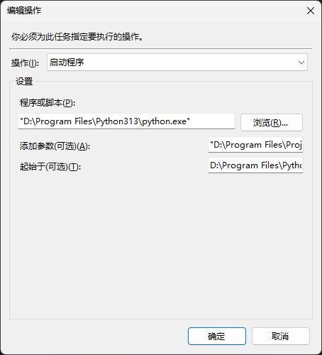

## windows定时任务创建问题排查

### 背景

目前需要创建每天定时执行的任务帮忙清理日常，想到采用windows自带的任务执行程序进行创建，自动化执行python脚本

### 问题1: 任务操作目录设置



以下是几个参数需要填写的内容:

- 程序或脚本: 这里进行浏览，找到系统安装的python.exe即可(注意: 一定要用自己下载的python版本，不要用微软商店自带的python版本，否则会自动安装到高权限的文件夹导致定时任务执行用户无法访问)
- 添加参数: 这里填要执行的脚本所存放的文件夹即可
- 起始于: 填写执行定时任务时的默认文件夹，在python没有添加到环境变量的时候需要填写

整体设置下来，执行的命令为

```shell
# cd [起始于的文件夹]
# [程序或脚本] [添加的参数]
cd D:Program Files\Python313
D:Program Files\Python313\python.exe "D:Program File\test.py"
```

### 问题2: 执行时报0x80070005

原因就是之前使用了微软商店自带的python版本导致的。[其他可能的权限设置](https://oracle-abc.wikidot.com/zh-blog:65)

### 问题3: 执行时报0x1

这是定时任务执行的脚本本身的报错导致的。在创建定时任务之前，确保脚本本身是能否正确运行的。

```shell
cd D:Program Files\Python313
D:Program Files\Python313\python.exe "D:Program File\test.py"
```

成功执行后，最后的状态码应为0x0